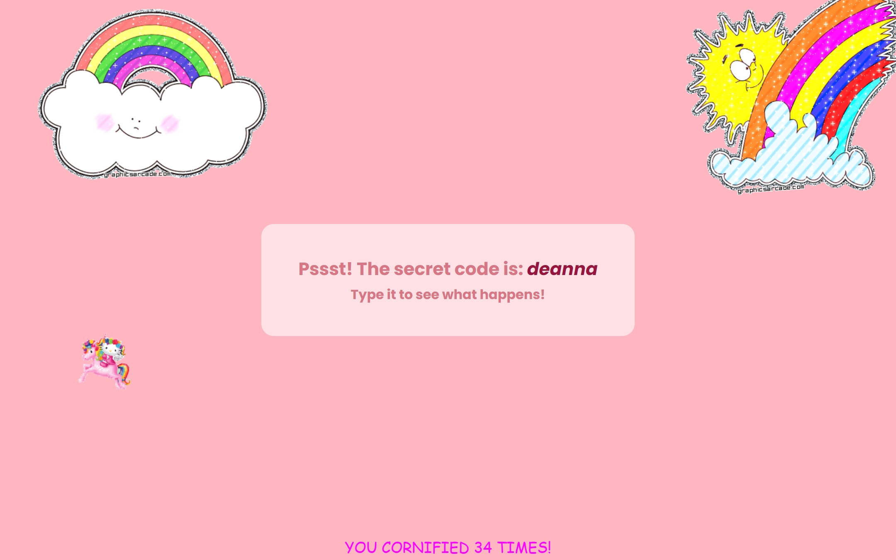

# Key Sequence Detection

A fun web-based interactive experience that triggers a playful animation when the user types a secret code. This project detects a specific key sequence and activates an exciting animation, providing an engaging experience for users who discover the hidden code.

## Description

This project is a simple yet fun interactive webpage that listens for a specific key sequence. When the user types the secret code (in this case, 'deanna'), a playful animation triggered by **Cornify** adds a lighthearted touch to the page. The page features a clean, minimalist design with a focus on the fun interaction of typing the secret code.

The website is built using HTML, CSS, and JavaScript. It employs basic layout techniques, such as Flexbox for centering the content and custom CSS variables for easy theming. The key sequence detection logic is implemented in JavaScript, which captures the `keyup` event to track the pressed keys.

## Features

- Simple interactive webpage that responds to a secret key sequence.
- Uses Flexbox to center and organize content for responsiveness.
- Includes smooth CSS transitions and custom variables for styling flexibility.
- Playful Cornify animation triggered when the correct key sequence is typed.
- Responsive typography using `clamp()` for dynamic font resizing.
- Interactive experience built with vanilla JavaScript for a smooth user experience.

## Technologies Used

- HTML
- CSS
- JavaScript

## How to Run

1. Clone the repository to your local machine.
2. Open `index.html` in your web browser to interact with the page.
3. Type the secret code ('deanna') on the page to trigger the animation.
4. Alternatively, view the live project on GitHub Pages: [Key Sequence Detection on GitHub Pages](https://deannamandarino.github.io/key-sequence-detection/).

## Acknowledgments

This project was completed as part of the JavaScript30 course. Special thanks to Wes Bos for the excellent resources and guidance throughout the course.